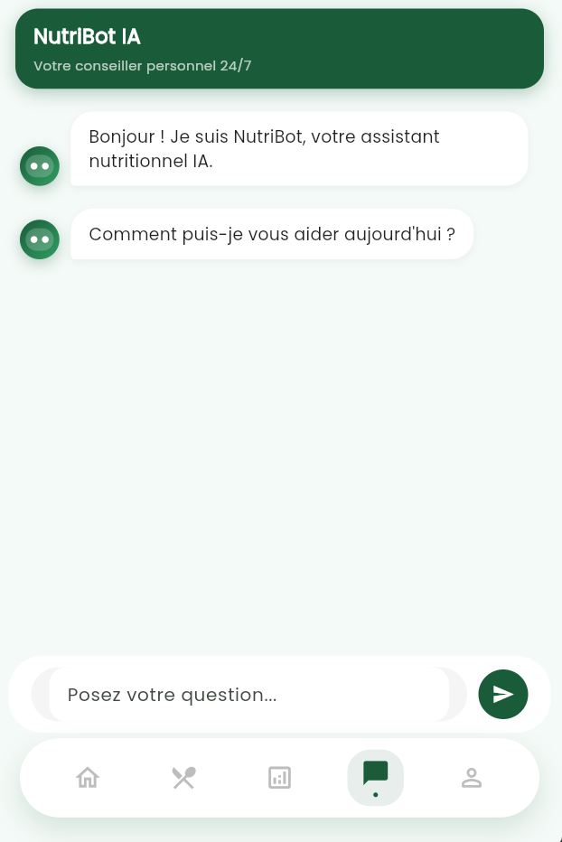
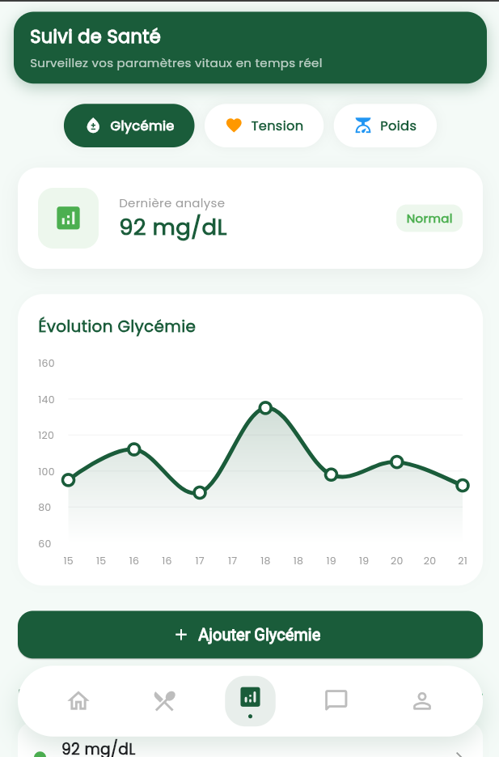
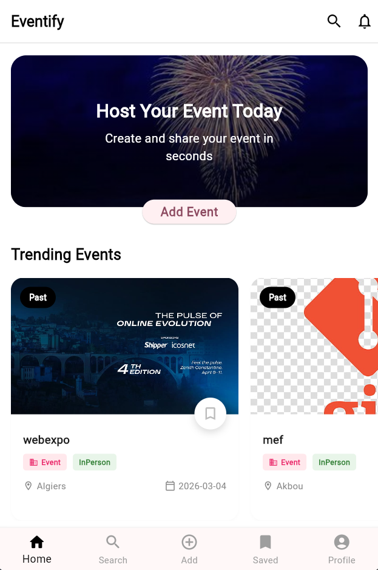
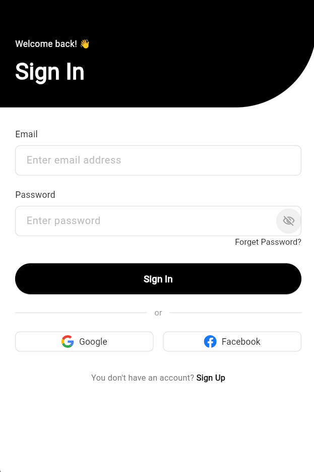

<h1 align="center">📱 Flutter Portfolio - Mouaad Draa</h1>

  🚀 Mobile App Developer | Flutter Specialist | Tech Content Creator

---

## 🧑‍💻 About Me

I am a passionate Flutter developer focused on building modern, scalable, and user-friendly mobile applications.

- 📱 Specialized in Flutter & mobile development  
- 🎯 Focused on real-world problem solving  
- 🎥 Sharing programming content on social media  
- 🚀 Constantly learning and improving  

---

## 📱 Projects

---

### 📖 Quran App

  
  

**Description:**
- Quran reading experience with clean UI  
- Audio playback with reciters  
- Smooth navigation between Surahs  

**Tech Used:**
- Flutter  
- Audio Service  
- State Management  

---

### 🏥 Healthcare App

  
  

**Description:**
- Appointment scheduling system  
- User-friendly interface  
- Designed for better healthcare access  

**Tech Used:**
- Flutter  
- Backend Integration  
- Clean UI  

---

### 🏢 Event Scheduler App

  
  

**Description:**
- Event management system for companies  
- Scheduling, notifications, and task tracking  
- Scalable architecture  

**Tech Used:**
- Flutter  
- MySQL / Backend  
- Authentication System  

---

## 🔒 Note

> These projects are private repositories.  
> Access can be provided upon request.

---

## 🛠️ Skills

- Flutter & Dart  
- Firebase / MySQL  
- REST APIs  
- Git & GitHub  

---

## 🌐 Connect With Me

- LinkedIn: https://www.linkedin.com/in/draa-mouaad-0407392b6/  
- Instagram: https://www.instagram.com/mouad_dev/  
- TikTok: https://www.tiktok.com/@mouaad_dev  
- Email: mouaad.draa@univ-constantine2.dz  

---

## 🚀 Vision

> My goal is to build impactful applications and grow as a professional software engineer.

---

  ⭐ If you like my work, feel free to connect!

